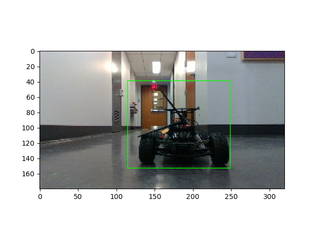

# Lab 8: Vision Lab

Camera mount height = 0.13527m
## The x, y distance of the unknown cones?
Distance to right bottom of the cone:
x = 0.5913m
y = -0.1265m

## Lane Detection Result Image

## Integrated Object Detection + Distance Calculation Result Image

x_car = 0.4695m, y_car = -0.065m

## Nerual Network Training & Testing Loss Plot

## Is FP16 faster? Why?
FP16 inference time (ms): 1.61s

FP32 inference time (ms): 1.6583s

You should time only the inference part and average out at least 100 inference cycles.
